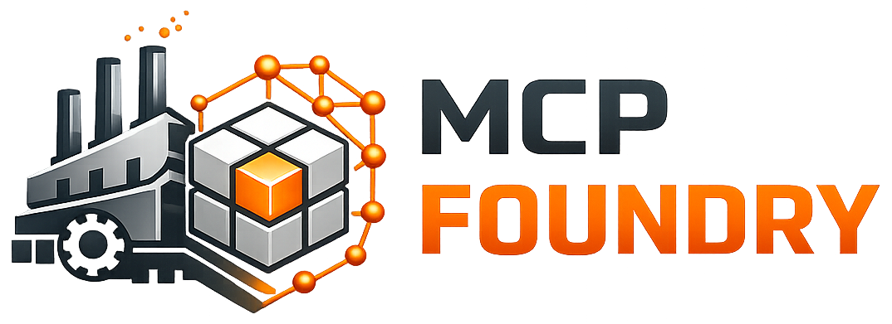

  

    <b>Local MCP Gateway & Knowledge Foundry for AI Systems</b>

    
    
    
    

---

**MCP Foundry** is a local-first control plane for building, deploying, and managing MCP servers backed by vector search.

It acts as a **gateway and manufacturing layer for MCPs**, allowing you to:

- Ingest documentation (e.g. Sphinx, Git repos, websites)
- Vectorize and store content in Qdrant
- Deploy MCP servers from configuration
- Monitor ingestion and query performance
- Customize chunking, embeddings, prompts, and tools

MCP Foundry turns knowledge sources into production-ready MCP servers — reliably and repeatedly.

<strong>
<a href="#getting-started">Quick Start</a> • 
<a href="#architecture">Architecture</a> • 
<a href="#features">Features</a> • 
<a href="ROADMAP.md">Roadmap</a> • 
<a href="#contributing">Contributing</a>
</strong>

---

## Architecture

MCP Foundry consists of:

- 🐍 **Python Backend (FastAPI)** – Control plane & orchestration  
- ⚛️ **React + TypeScript UI** – Deployment & monitoring dashboard  
- 🧠 **Qdrant Vector Database** – Retrieval layer  
- 🔌 **Pluggable ingestion pipeline** – Git, Sphinx, websites (extensible)  
